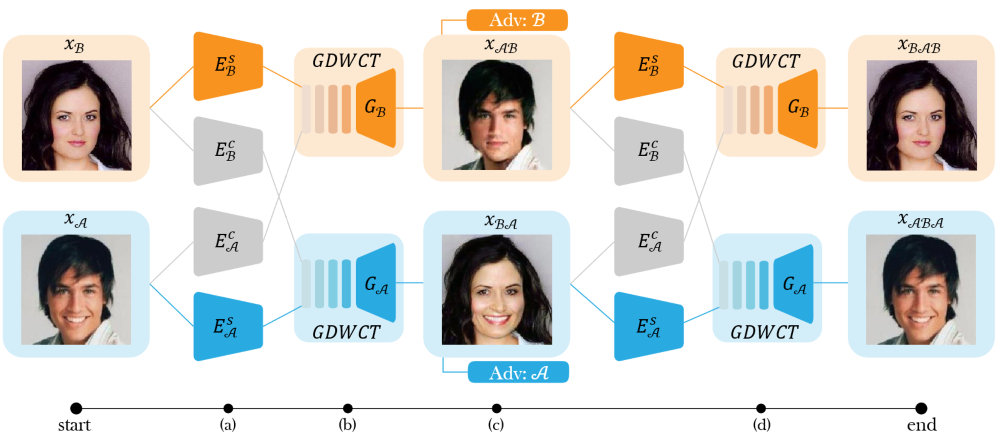
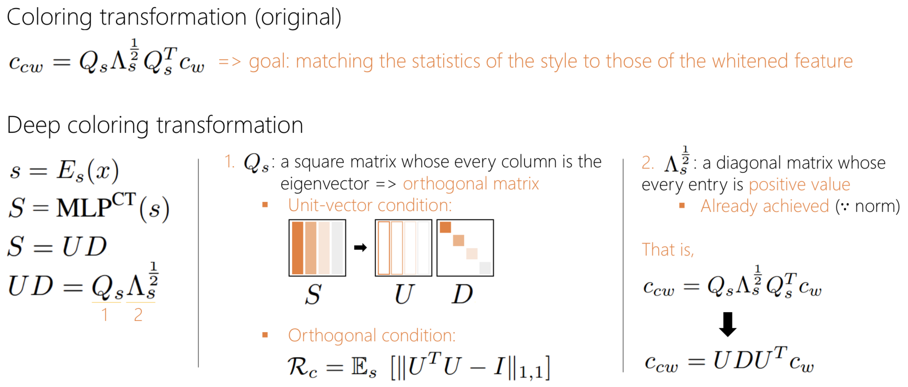
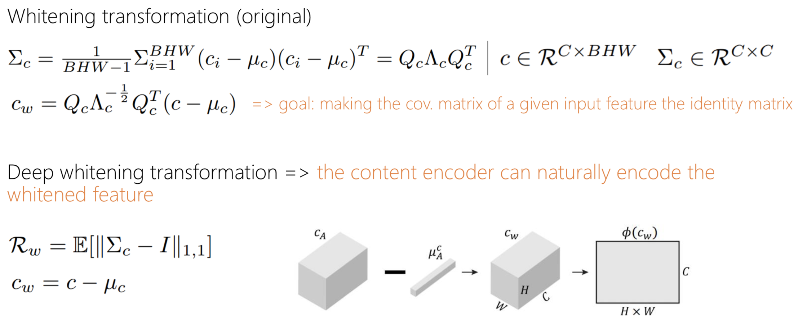
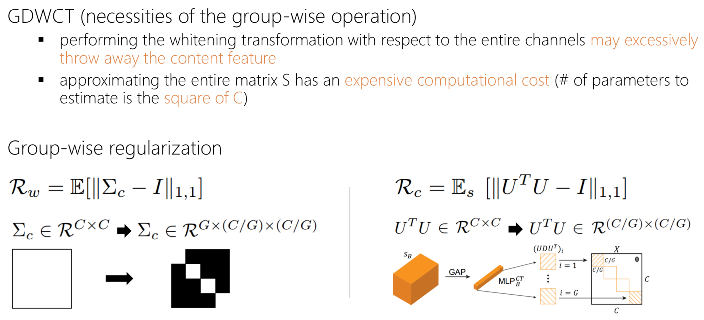
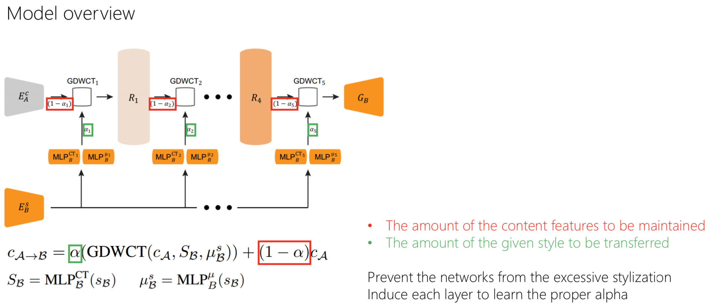
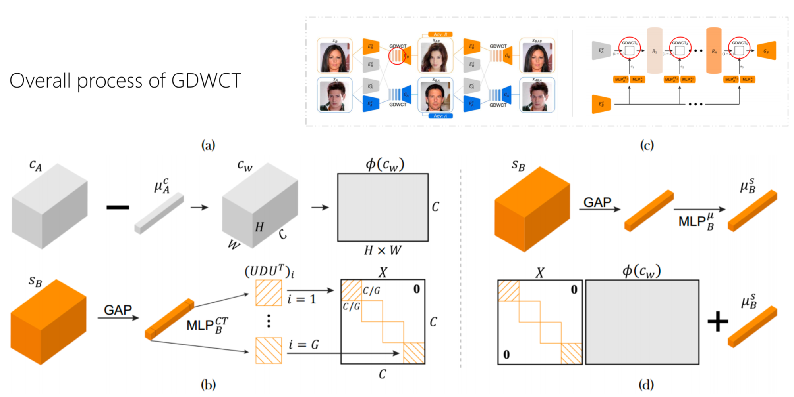
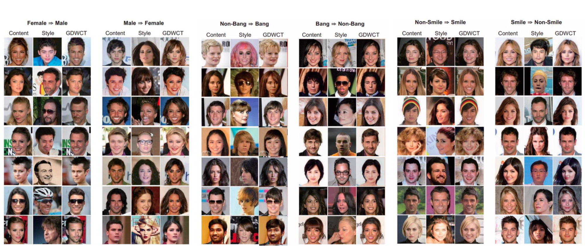

</img>



### [Paper](https://arxiv.org/abs/1812.09912) | [Pytorch code](https://github.com/WonwoongCho/GDWCT) | [Slide](https://drive.google.com/file/d/1EnY8iUuzwOn9tVDsgJUwt6o05Ic7-f1w/view)

## Usage
```
├── dataset
   └── YOUR_DATASET_NAME
       ├── trainA
           ├── xxx.jpg (name, format doesn't matter)
           ├── yyy.png
           └── ...
       ├── trainB
           ├── zzz.jpg
           ├── www.png
           └── ...
       ├── testA
           ├── aaa.jpg 
           ├── bbb.png
           └── ...
       └── testB
           ├── ccc.jpg 
           ├── ddd.png
           └── ...
           
├── guide.jpg (example for guided image translation task)
```

### Train
```
 > python main.py --dataset male2female
```

### Test
```
 > python main.py --dataset male2female --phase test --guide_img ./guide.png
```

## Summary
### Coloring


---

### Whitening


---

### GDWCT


---

### Model


---

### Process



## Results


## Author
[Junho Kim](http://bit.ly/jhkim_ai)
